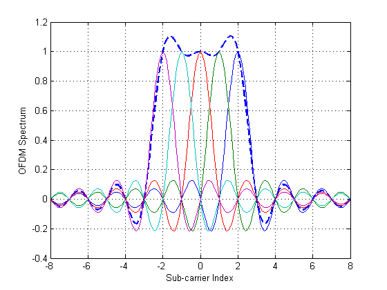
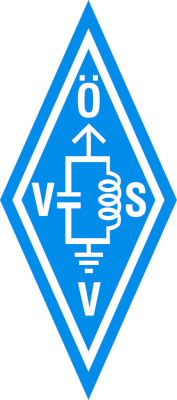
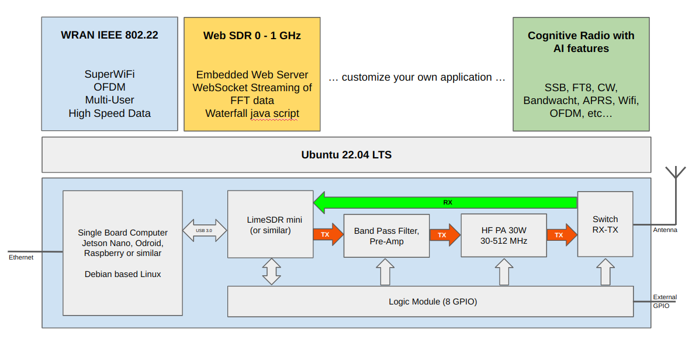

<table style="border:0" style="width:100%">
 <tr>
  <td></td>
    <td>
    <b>Open SDR Platform</b><br><br>
         Austria:<br>
        OE3BIA, OE9RIR, OE9RWV, Fabian (OE9xxx)<br><br>
         France:<br>         
        F4VVO<br><br>
        Web: <a href="https://rpx-100.net">www.rpx-100.net</a><br>
        </td>
        <td align="center">
        <a href="https://oevsv.at/home/" target="_blank"></a><br><br>
        <a href="https://www.tuwien.at/en/" target="_blank"></a>
    </td>
 </tr>
</table>

<h1>Overview</h1>
WRAN (Wireless Regional Area Network) is a new digital radio transmission mode (Super Wi-Fi) developed by Radio Amateurs in Austria allowing high speed data communication in Sub-GHz Frequency bands.<br><br>
Requirements for the new communication system are to support sufficient bandwidth for each user, and to enable multiple users at the same time to connect to a base station.
The implementation of the new digital transmission mode is based on the concept of a software defined radio using the LimeSDR ecosystem and the builds on the IEEE 802.22 standard. The Open SDR Platform addresses developers building software for radio communication and integrates artificial intelligence (AI) into radio transmission and propagation.<br><br>
Hardware and software are designed as kit, the RPX-100, which allows a modular use and supports all possible Sub-GHz frequency bands.<br><br>
<p align="center"></p>
<h1>RPX-100 Transceiver Kit</h1>
The RPX-100 is a modular kit for a software defined transceiver using standard embedded boards running linux such as the Odroid C4 or the Jetson Nano.
Most common Software Defined Radios with USB interface are supported, the kit comes with the LimeSDR mini 2.0. It includes a Radio Frontend with software defined band pass filters and a class A amplifier with output power of 25W and is designed to operate on all Sub GHz Frequencies.<br><br>

The RPX-100 can be supplied with 9-24V to allow any mobile or fixed power supply. Interfaces such as GPIO, display boards, etc. are available for optional add-ons such as display, Microphone or buttons and keyboard. Alternatively a Raspberry Compute Module 4 or the Odroid C4 can be used as embedded CPU.

The source code for this project can be found in the following repositories on GitHub:

<ul>
<li>WRAN Project Website (https://rpx-100.net):  <a href="https://github.com/WRAN-OEVSV/Website" target="_blank">https://github.com/WRAN-OEVSV/Website</a></li>
<li>WRAN - IEEE802.22 Application for RPX-100: <a href="https://github.com/WRAN-OEVSV/802_22_Base" target="_blank">https://github.com/WRAN-OEVSV/802_22_base</a></li>
<li>WebSDR for RPX-100: <a href="https://github.com/WRAN-OEVSV/WebSDR" target="_blank">https://github.com/WRAN-OEVSV/WebSDR --> Integration into base ongoing</a></li>
</ul>

Before compiling the code on the embedded device the following dependencies need to be installed manually:

<ul>
<li>automake</li>
<li>autoconf</li>
<li>build-essentials</li>
<li>cmake (latest version or >= 3.25.1)</li>
<li>libssl-dev</li>
<li>libsoapysdr-dev</li>
<li>limesuite</li>
</ul>

Cloning for embedded devices has to be done recursive: `git clone --recursive git@github.com:WRAN-OEVSV/WebSDR.git`
In the directory of the cloned source code do: `mkdir build && cd build && cmake .. && make`

<h2>Get started with a new Odroid-C4:</h2>

Download latest Ubuntu minimal image for Odroid-C4:<br>
https://wiki.odroid.com/odroid-c4/os_images/ubuntu/minimal/20220705

Extract the file on you host PC and connect the EMMC memory module for the Odroid-C4 to your USB port. Check in /dev/... the address of the
EMMC, e.g. /dev/sdf

On your host PC (linux):<br>
```ruby
sudo dd if=ubuntu-22.04-4.9-minimal-odroid-c4-hc4-20220705.img of=/dev/sdf
```

Plug the EMMC memory modul to the socket at the bottom of the Odroid-C4, connect the ethernet cable and power up the device. Check your Lan Router and find out the IP address asigned to the new Odroid-C4. Connect from your host PC (linux), initial password is ‘odroid’:<br>
```ruby
ssh root@10.0.0.134
```

Install prerequisits on your new Odroid-C4:<br>
```ruby
sudo apt update
sudo apt upgrade
sudo apt install build-essential
sudo apt install automake autoconf
sudo apt install libssl-dev libsoapysdr-dev limesuite
```

Install leatest version of CMAKE:<br>
```ruby
sudo apt update
sudo apt upgrade
sudo apt install -y software-properties-common lsb-release
sudo apt clean all
wget -O - https://apt.kitware.com/keys/kitware-archive-latest.asc 2 /dev/null | gpg --dearmor - | sudo tee /etc/apt/trusted.gpg.d/kitware.gpg /dev/null
sudo apt-add-repository "deb https://apt.kitware.com/ubuntu/ $(lsb_release -cs) main"
sudo apt update
sudo apt install cmake
```

Create a ssh-key for cloning and updating software in the Github repository:<br>
```ruby
ssh-keygen -t rsa -b 4096
```

The new key can be found in ~/.ssh/.id_rsa.pub. Copy the content of that file and past it as new key in your github settings:<br>
https://github.com/settings/profile

Clone the lates sofwarefor the RPX-100 from Github (recursive):<br>
```ruby
git clone --recursive git@github.com:WRAN-OEVSV/802_22_Base.git
```

Connect with Visual Code using the Remote SSH pugin:<br>
https://code.visualstudio.com/docs/remote/ssh
